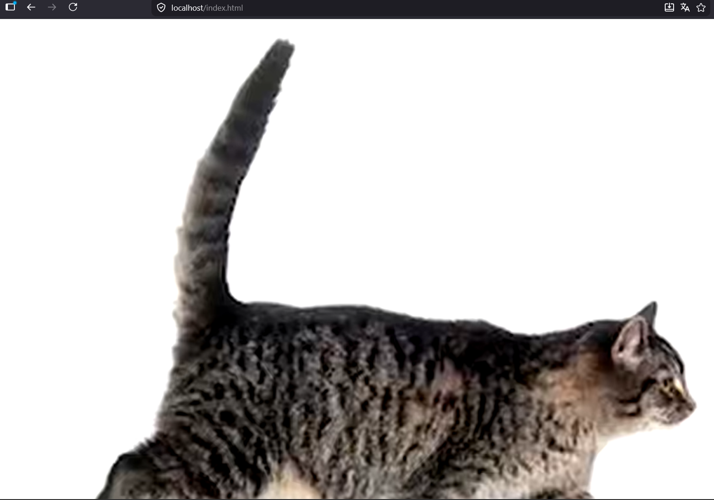
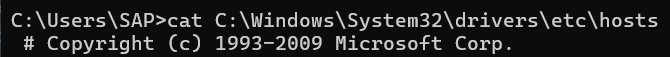
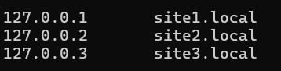
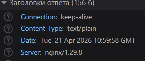
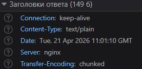
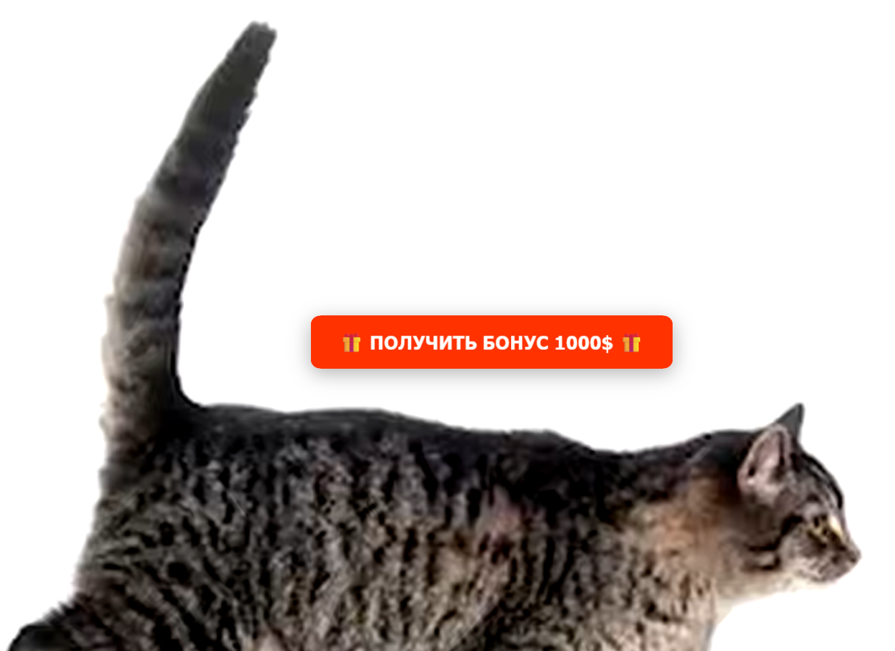
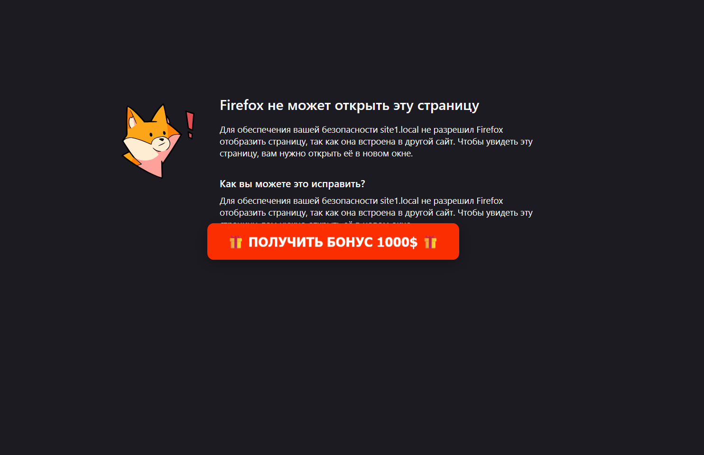
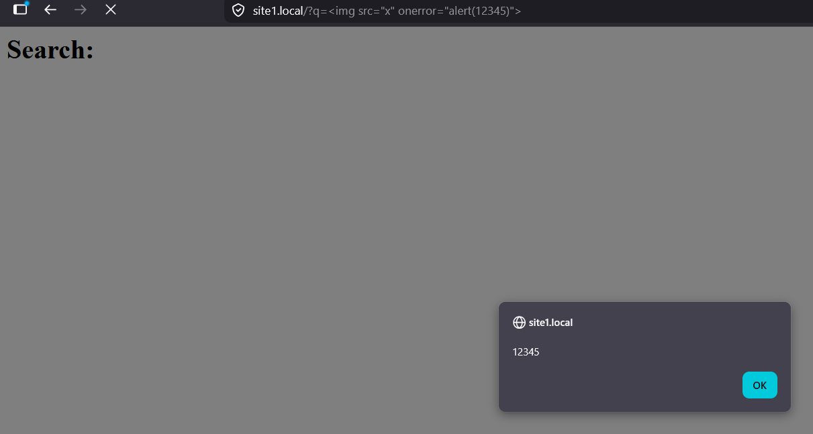

# lab3

## 1 часть

### Подготовка

#### server.js
Я написал простой скрипт на ноде server.js, который всегда возвращает 200 "Hello world" в GET запросе

```
// server.js
const http = require('http');

const server = http.createServer((req, res) => {
    if (req.method === 'GET') {
        res.writeHead(200, { 'Content-Type': 'text/plain' });
        res.end('Hello World');
    } else {
        res.writeHead(405);
        res.end('Method Not Allowed');
    }
});

const PORT = 3000;

server.listen(PORT, () => {
    console.log(`Server running at http://localhost:${PORT}`);
});
```

#### docker-compose.yml
Настроил docker-compose.yml
- контейнер для nginx
- контейнер для ноды

```
# docker-compose.yml
version: '3.8'

services:
  node:
    image: node:18
    container_name: node_app
    working_dir: /app
    volumes:
      - .:/app
    command: node server.js
    ports:
      - "3000:3000"

  nginx:
    image: nginx:latest
    container_name: nginx_server
    ports:
      - "80:80"
      - "443:443"
    volumes:
      - ./nginx.conf:/etc/nginx/nginx.conf:ro
      - ./certs:/etc/nginx/certs:ro
      - ./static:/static:ro
    depends_on:
      - node
```

#### nginx
Возвращает server.js 

```
# nginx
events {}
http {
    server {
        listen 80;
        location / {
            proxy_pass http://node:3000;
        }
    }
}
```

#### Папка static 
там кот и index.html с этим котом

> Настроить nginx по заданым критериям

### Должен работать по https c сертификатом
Чтобы выполнить эту задачу, я воспользовался утилитой mkcert, которая создаёт локальный доверенный центр сертификации и выпускает сертификаты для localhost и локальных доменов. Прописал в volumes nginx их и добавил их в nginx.conf

```
events {
}

http {
    server {
        listen 443 ssl;
        server_name localhost;

        ssl_certificate /etc/nginx/certs/localhost+2.pem;
        ssl_certificate_key /etc/nginx/certs/localhost+2-key.pem;

        location / {
            proxy_pass http://node:3000;
        }
    }
}
```


### Настроить принудительное перенаправление HTTP-запросов (порт 80) на HTTPS (порт 443) для обеспечения безопасного соединения

```
http {
    server {
        listen 80;
        server_name localhost;
        return 301 https://$host$request_uri;
    }
    
    server {
        listen 443 ssl;
        server_name localhost;

        ssl_certificate /etc/nginx/certs/localhost+2.pem;
        ssl_certificate_key /etc/nginx/certs/localhost+2-key.pem;

        location / {
            proxy_pass http://node:3000;
        }
    }
}
```
### Использовать alias для создания псевдонимов путей к файлам или каталогам на сервере.

```
events {
}

http {
    server {
        listen 80;
        server_name localhost;
        return 301 https://$host$request_uri;
    }

    server {
        listen 443 ssl;
        server_name localhost;

        ssl_certificate /etc/nginx/certs/localhost+2.pem;
        ssl_certificate_key /etc/nginx/certs/localhost+2-key.pem;

        # алиас который по localhost/index.html вернёт /static/index.html
        location = /index.html {
            alias /static/index.html;
        }

        # алиас который по localhost/img/cat.png вернёт /static/assets/cat.png
        location /img/ {
            alias /static/assets/;
        }

        location / {
            proxy_pass http://node:3000;
        }
    }
}
```


### Настроить виртуальные хосты для обслуживания нескольких доменных имен на одном сервере.
Перед тем как выполнить эту задачу добавил несколько loopback'ов в etc/hosts 



```
events {
    worker_connections 1024;
}

http {
    server {
        listen 80;
        server_name site1.local;
        return 301 https://$host$request_uri;
    }

    server {
        listen 443 ssl;
        server_name site1.local;

        ssl_certificate /etc/nginx/certs/localhost+2.pem;
        ssl_certificate_key /etc/nginx/certs/localhost+2-key.pem;

        location = /index.html {
            alias /static/index.html;
        }

        location /img/ {
            alias /static/assets/;
        }

        location / {
            proxy_pass http://node:3000;
        }
    }


    server {
        listen 80;
        server_name site2.local;

        location / {
            return 200 "site2";
        }

    }
}

```


### Что угодно еще под требования проекта
Я решил добавить немного защиты от того стандартных веб уязвимостей
```
events {
    worker_connections 1024;
}

http {
    # Скрываем версию nginx(тк она может содержать уязвимости, что упростит злоумышленнику задачу по подбору эксплойта)
    server_tokens off;
       
    server {
        listen 80;
        server_name site1.local;
        return 301 https://$host$request_uri;
    }

    server {
        
        listen 443 ssl;
        server_name site1.local;

        ssl_certificate /etc/nginx/certs/localhost+2.pem;
        ssl_certificate_key /etc/nginx/certs/localhost+2-key.pem;

        location /index.html {
            # Защита от clickjacking (блок iframe для сторонних сайтов)
            add_header X-Frame-Options "DENY"; 
            alias /static/index.html;
        }

        location /img/ {
            alias /static/assets/;
        }

        location / {
            # Защита от XSS
            add_header X-XSS-Protection "1; mode=block";    
            # MIME-sniffing защита
            add_header X-Content-Type-Options "nosniff";
            proxy_pass http://node:3000;
        }
    }


    server {
        listen 80;
        server_name site2.local;

        location /{
            return 200 "site2";
        }

    }
}
```

Проверим результат
|           | До      | После        |
|-----------|---------|--------------|
| server_tokens|       |        |
| clickjacking*     |       |  |
| XSS**    |       |   [](images/image11.png)     |

* для проверки clickjacking попросил нейронку сгенерировать clickjacking.html кторый поверх iframe добавляет навязчивую кнопку

** для проверки xxs изменил server.js так чтобы сервер возвращал разметку
```
// server.js
const http = require('http');
const url = require('url');

const server = http.createServer((req, res) => {
    const query = url.parse(req.url, true).query;

    res.writeHead(200, { 'Content-Type': 'text/html' });

    res.end(`
        <html>
            <body>
                <h1>Search: ${query.q || ''}</h1>
            </body>
        </html>
    `);
});

const PORT = 3000;

server.listen(PORT, () => {
    console.log(`Server running at http://localhost:${PORT}`);
});
```
> на уровне nginx X-XSS-Protection просто браузерный костыль, поэтому лучше просто экранировать символы <> на бэке


## 2 часть

